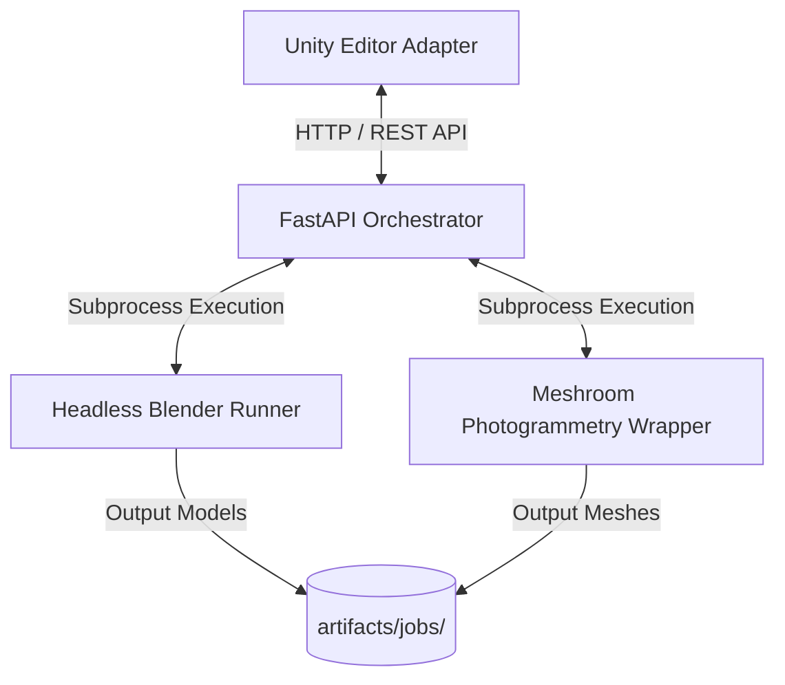

# Anti-Gravity Bridge: System Architecture

The Anti-Gravity Bridge is an integration subsystem layer in `ISLAND` designed to connect the Unity Editor, headless Blender, and Meshroom photogrammetry tasks.

## System Overview

## Component Breakdown

1. **Unity Editor Adapter (`unity/AntigravityUnityBridge.cs`)**
   * Editor-only utility window that mounts inside the Unity `Tools/` menu.
   * Leverages `UnityWebRequest` to trigger health checks, command dispatches, and synchronize local asset manifests.

2. **FastAPI Orchestrator (`orchestrator/main.py`)**
   * Handles request validation using versioned schemas (`schemas/`).
   * Routes synchronous actions using the `/command` endpoint.
   * Manages async execution pools via FastAPI `BackgroundTasks` under `/jobs`.

3. **Headless Blender Runner (`blender/blender_runner.py`)**
   * Spawns Python scripts backgrounded inside Blender.
   * Runs in dry-run simulation mode when Blender is absent, writing placeholder `.glb` models to test pipeline structures.

4. **Meshroom Wrapper (`meshroom/meshroom_wrapper.py`)**
   * Executes photogrammetry mesh construction pipelines.
   * Preflight checks confirm Nvidia CUDA capability (`nvidia-smi`) and validation of incoming source images.
